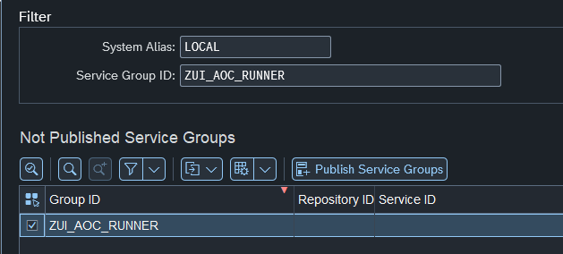
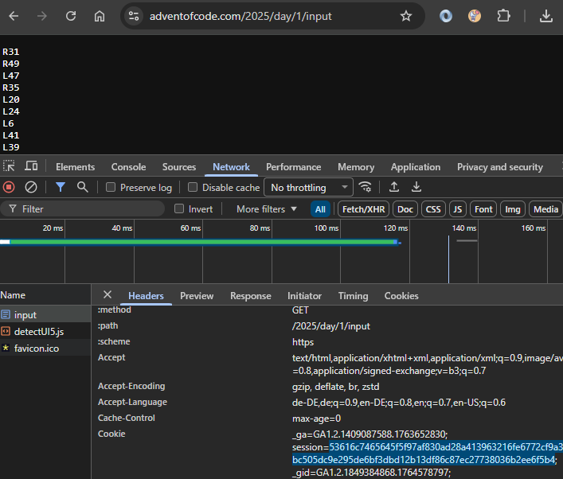
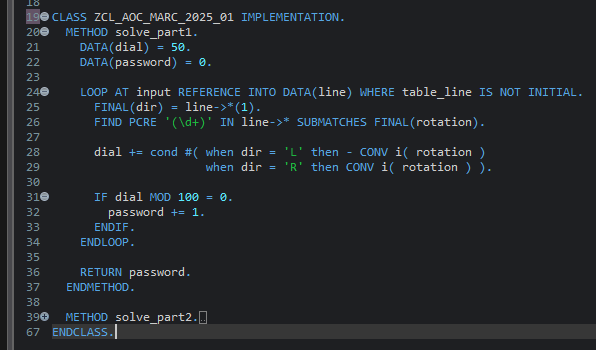
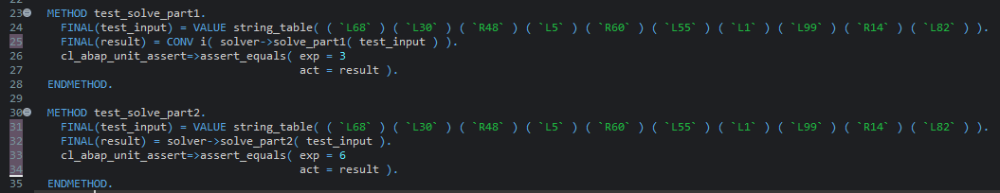

# ABAP AoC Runner

A framework to solve [Advent of Code](https://adventofcode.com/) problems using ABAP.

## Prerequisites

- This framework uses RAP so I guess you need an S/4 system. I developed it in our playground system (S4HANA ON PREMISE 2023, SAP_BASIS 758)
- [abapgit](https://docs.abapgit.org/)
- System must be able to make HTTP calls to the outer world (to fetch data from `https://adventofcode.com/`)
- Each participant needs an account on https://adventofcode.com/

## Installation

1. Install this tool in your S/4 system using [abapgit](https://docs.abapgit.org/) in a local package (e.g. `$ADVENTOFCODE`).
1. In `/n/IWFND/V4_ADMIN` publish the service group `ZUI_AOC_RUNNER`  

## Usage

### Preparation
1. Extract your session cookie: 
 You only need the highlighted hex string after `session=` and before `;`
1. Create your own local package where the puzzle classes will be generated. Since each year will have up to 25 ABAP classes it might make sense to create a local package for each user and year (e.g. `$AOC2025_MARC`). 
1. Open the `Participant` entity preview in the service binding `ZUI_AOC_PARTICIPANT_O4`. Create a new entry with the year number you want to solve (e.g. `2025`), the package created for your solutions (e.g. `$AOC2025_MARC`, **not** `$ADVENTOFCODE`) and your auth cookie for the AoC page.
1. On the detail page of this new row you can now add the days you want to solve (maybe create them one at a time). In `Edit` mode create a new `Day` entry and pass the day number (1-25). When pressing `Save` the *ABAP AoC Runner* automatically downloads your puzzle input and creates a class `ZCL_AOC_[SAPUSER]_[YEAR]_[DAY]` (e.g. `ZCL_AOC_MARC_2025_01`).

### Solving
1. Open the newly generated solver class in Eclipse
1. Replace the dummy implementation of the solver methods with your real implementation. The puzzle input (a `string_table`) is passed to both methods.
Here is a sample implementation of 2025/01 part 1:  

1. The solver class contains a local test class that can be filled with the sample input from the AoC page. It can be executed by <kbd>Ctrl</kbd> + <kbd>Shift</kbd> + <kbd>F10</kbd> or right-clicking your solver class and selecting `Run As > ABAP Unit Test`.
Here is a sample test implementation of 2025/01:  
1. The solver class is runnable via <kbd>F9</kbd> and executes `solve_part1` and `solve_part2` and prints the result to the Eclipse console. This result can be entered on the AoC webpage to gain stars.

## Caution

I am not an ABAP pro so my framework might need some tweaking. I am very open to suggestions and pull requests.

## To-Dos

- [ ] Other users should not see everones auth cookies (until then please don't abuse others auth cookies 😵)
- [ ] Update counter of "Problems solved" in Participants entity when user marks individual Days as solved
- [ ] Add more screenshots to readme so it looks less dead.
